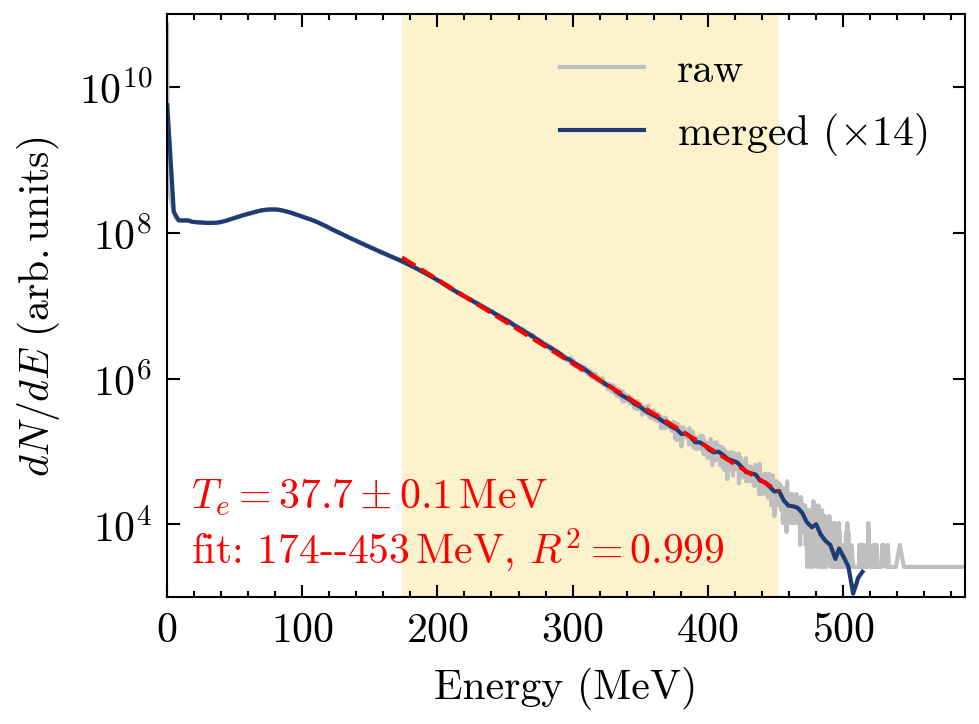

# Maxwellian Fit

[](https://doi.org/10.5281/zenodo.21916258)

Find the temperature of a particle energy spectrum, `dN/dE = C exp(-E/T)`, by linear regression on the log of the counts.

The `auto_maxwellian` detects that range from the data instead, so the same settings work across a whole time series of spectra, and `maxwellian_gui` wraps it in a window for interactive use.



## Contents

| File | What it is |
| --- | --- |
| `auto_maxwellian.py` | automatic range detection + fit (NumPy only) |
| `maxwellian_gui.py` | Tkinter GUI: load, fit, style the figure, save |
| `Example_Maxwellian_fit.ipynb` | worked example producing the figure above |
| `figformat.py` | the matplotlib style used for the figures |
| `histogram_1.dat` | example spectrum: column 0 = counts, column 1 = energy [MeV] |

## Requirements

NumPy and matplotlib. The GUI uses Tkinter, which ships with CPython (`sudo apt install python3-tk` if your distribution splits it out).

For `LaTeX` font rendering of `matplotlib` figures, under `Ubuntu 20.04`:

```console
$ sudo apt install dvipng texlive-latex-extra texlive-fonts-recommended cm-super
```

## Automatic fit

```python
import numpy as np
from auto_maxwellian import auto_maxwellian_fit

counts, energy = np.loadtxt("histogram_1.dat", unpack=True, usecols=[0, 1])
result = auto_maxwellian_fit(energy, counts)
print(result.summary())
```

```
T_hot     = 37.692 +/- 0.096 MeV
fit range = [173.856, 452.551] MeV   (auto-detected)
falloff   = 3.21 decades over 82 bins
R^2       = 0.9994    chi2/dof = 1.07
amplitude = 4.642e+09
log noise = 0.050 (measured)
```

`result` also carries `T`, `T_err`, `Emin`, `Emax`, `C`, `slope`, `intercept`, the merged spectrum (`E_rebin`, `dNdE_rebin`) used for plotting, and a `message` warning when the window is short or starts at the first populated bin. `Maxwellian_fit_auto(counts, energy)` returns the temperature alone.

How it works: adjacent bins are merged to suppress single-macroparticle spikes, the log-space scatter is measured from the data itself (a weighted PIC histogram has no fixed count quantum, so Poisson errors cannot be recovered from the bin values), and the widest window that stays straight to within that measured noise is taken as the tail — with a curvature test that keeps the knee and the cold bulk out, and an occupancy cut that discards the sparse high-energy end where the spectrum is individual macroparticles rather than a distribution. `local_temperature()` returns the sliding-window `T_loc(E)`, whose plateau is the tail; it is the quickest check that a detected range is sane.

The settings worth touching are `n_target` (bins after merging; lower it for noisy spectra), `max_chi2` (straightness tolerance), `max_curvature` (how much curvature a window may hold, in sigma), `min_decades` (least falloff an accepted window must span), and `Emin_floor`/`Emax_ceil` if a region must be excluded a priori. All are documented in the `auto_maxwellian_fit` docstring.

## GUI

```console
$ python maxwellian_gui.py [spectrum.dat]
```

- **Data & fit** — choose the file and which columns hold counts and energy (plus header rows and delimiter), then set any of the detection parameters above. **Fit && plot** runs the fit and prints the report.
- **Figure** — figure width and height in inches, font size, save dpi, LaTeX rendering, title, axis labels, linear/log scales, axis limits (blank means automatic), and which elements are drawn: raw spectrum, merged spectrum, shaded fit range, fit line, temperature annotation, legend, minor ticks.
- **Save figure...** writes png, pdf, svg or eps at the chosen dpi; **Save report...** writes the fit numbers together with the settings that produced them.

The matplotlib navigation toolbar under the plot gives pan, zoom and a quick save at screen resolution.

## Citation

If this code contributed to your work, please cite the archived release:

> Ong, J. F. (2026). *Maxwellian_fit: automatic hot-electron temperature fitting of particle energy spectra* (v2.0.0). Zenodo. https://doi.org/10.5281/zenodo.21916259

```bibtex
@software{ong_maxwellian_fit_2026,
  author    = {Ong, Jian Fuh},
  title     = {Maxwellian\_fit: automatic hot-electron temperature fitting of particle energy spectra},
  version   = {v2.0.0},
  publisher = {Zenodo},
  year      = {2026},
  doi       = {10.5281/zenodo.21916259},
  url       = {https://doi.org/10.5281/zenodo.21916259}
}
```

The DOI above pins v2.0.0. [10.5281/zenodo.21916258](https://doi.org/10.5281/zenodo.21916258) is the concept DOI, which always resolves to the newest release.
