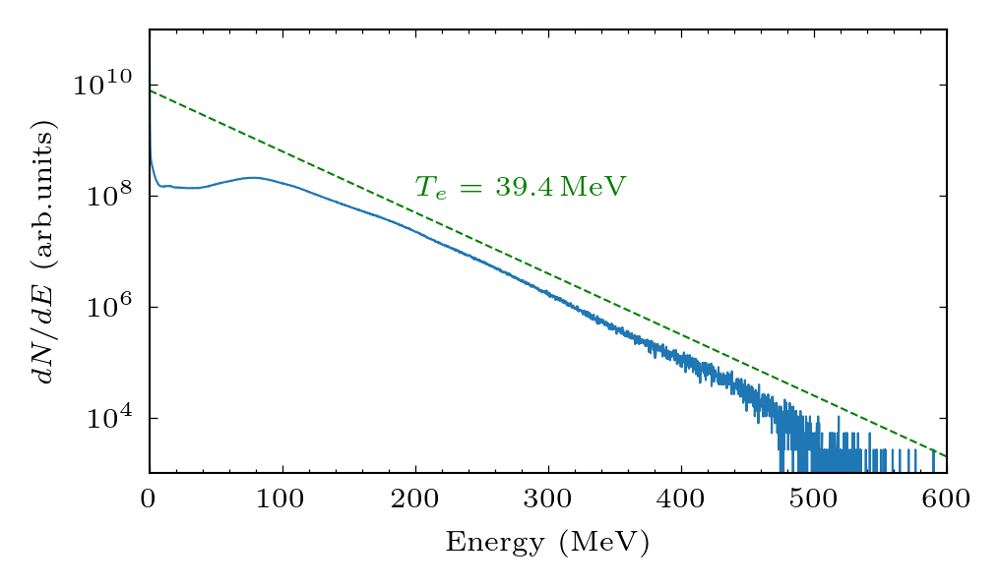

# Maxwellian_fit

Maxwellian_fit find the temperature of an energy histogram through linear regression. Regression library from [scikit-learn](https://scikit-learn.org/stable/index.html) is required. To install, see [scikit-learn install](https://scikit-learn.org/stable/install.html)

For `LaTeX` font rendering of `matplotlib` figures, under `Ubuntu 20.04`:

```console
$ sudo apt install dvipng texlive-latex-extra texlive-fonts-recommended cm-super
```



The script is developed for the generation of plots in the following publications:

- I Tazes, J F Ong, O Tesileanu, K A Tanaka, N A Papadogiannis, M Tatarakis and V Dimitriou, Target normal sheath acceleration and laser wakefield acceleration particle-in-cell simulations performance on CPU & GPU architectures for high-power laser systems, 2020 Plasma Phys. Control. Fusion 62 094005.
